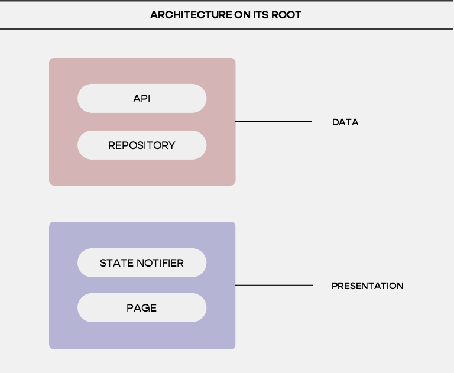
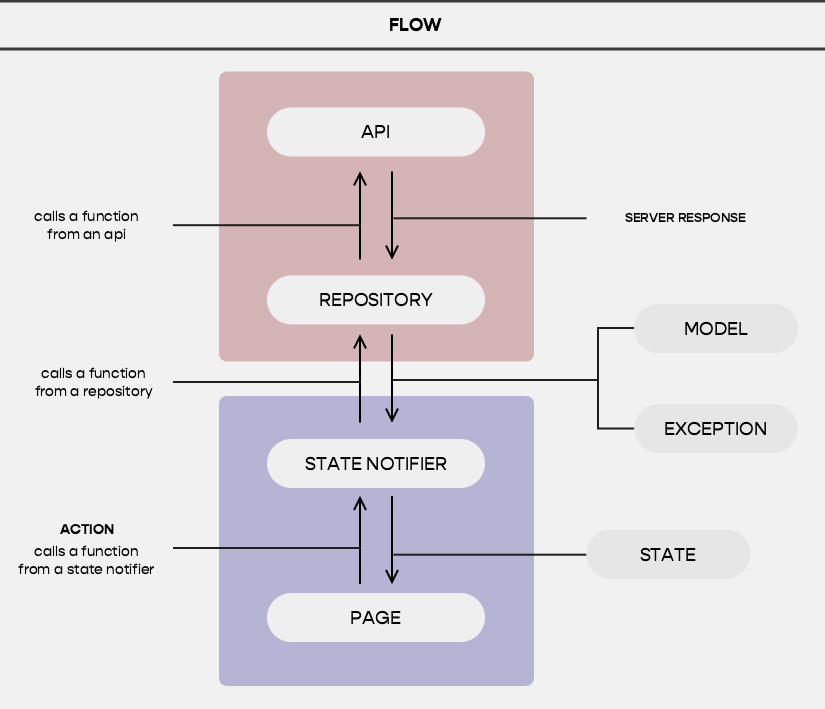
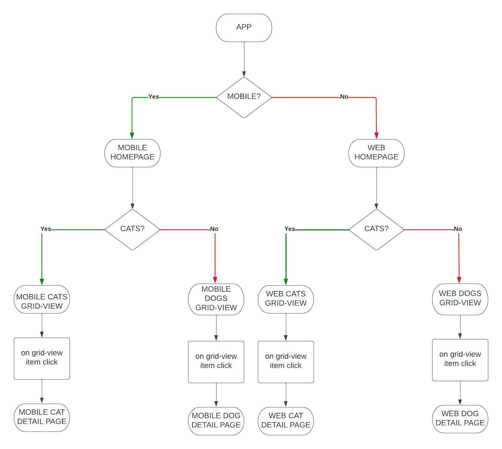

# FIGOZO FL PRACTICAL

A test project.

&nbsp;
# VIDEOS
mobile: https://firebasestorage.googleapis.com/v0/b/furniture-design-mobileapp.appspot.com/o/video_mobile.mp4?alt=media&token=24416e9a-3c26-4dbe-9bc6-fd1c073d3c24

web: https://firebasestorage.googleapis.com/v0/b/furniture-design-mobileapp.appspot.com/o/video_web.mp4?alt=media&token=20925c26-7dca-4dc0-bba6-6399f46042ac

&nbsp;
# TOOLS
### State Management:  
Freezed - https://pub.dev/packages/freezed   
Getx - https://pub.dev/packages/get 

### Theming:
FlexColorSchemes: https://pub.dev/packages/flex_color_scheme

### Navigation:  
Getx.

### Local Storage:
Hive: https://pub.dev/packages/hive

### Network Requests:
Http: https://pub.dev/packages/http 

&nbsp;
# ARCHITECTURE

The architecture is made following the layer-first approach. There are basically two layes: The data layer and the presentation layer.  
The Data layer is responsible for performing network / local calls e.g fetching data from apis and the
Presentation layer is responsible for performing presentation logic and as a result show a piece of UI
on the screen.

These two layers are further sub-divided to their sub-layers:
The Data layer is sub-divided to the API and the Repository layers. The API layer will perform
network / local calls and return unstructured data e.g json. The sole responsibility of the Repository layer
is to
convert the unstructured data from the API layer to structured predefined data:- models.

The Presentation layer is sub-divided to State-Notifiers and Pages layer. Pages are mere UIs (widgets). But
what UI is to be rendered on the screen is completely under the control of the state-notifiers. Hence the
saying UI = f(state) holds true for this case.

State Notifiers are created using Getx-Controllers. States are created using Freezed.  

&nbsp;
# ARCHITECTURE FLOW

&nbsp;
# UI Flow
 . 

